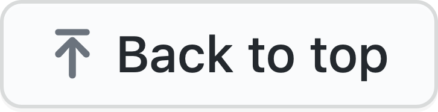

 

# OnePass

## Description

A desktop application to securely store all your passwords at one place and manage them through a single master password.
Passwords are encrypted using Advanced Encryption Standard (AES) and Cipher block chaining (CBC).
CBC is a mode of operation for a block cipher in which a sequence of bits are encrypted as a single unit or block with a cipher key applied to the entire block.
Here, not only the passwords are encrypted but also the name/key associated with the passwords are encrypted i.e. the complete database is encrypted.

Content Files
- Data is stored in data/data.json file.
- symmetric encryption key, algorithm name, Initialization vector length, and password length is stored in configs/configs.json.

<!-- 
## Download Application

- <a href='#'>Windows</a> -->

## Features

- Strong Security.
- Store your Passwords at one place.
- Acess all your passwords with only one master password.
- Generate strong random passwords.
- Searching.
- Edit/Delete your passwords.
- Change your master password.
- Export all your passwords to csv file.

## Demo

<!-- <h4 align="center">Chatting Page</h4> -->

 

<!--  -->

<h4 align="center">Export to CSV</h4>

### Prerequisite

- You need to install [Node.js](https://nodejs.org/en/download/).

## To run the project locally

- clone this repository using `git clone https://github.com/shahshubh/OnePass.git`.
- cd into the root folder using `cd OnePass`.
- Run `npm install` to install the dependencies.
- Finally run `npm start`.

 

This project was made as an IA assignment for the course Cryptography and System Security and tried to implement few features of [KeePass](https://keepass.info/).

